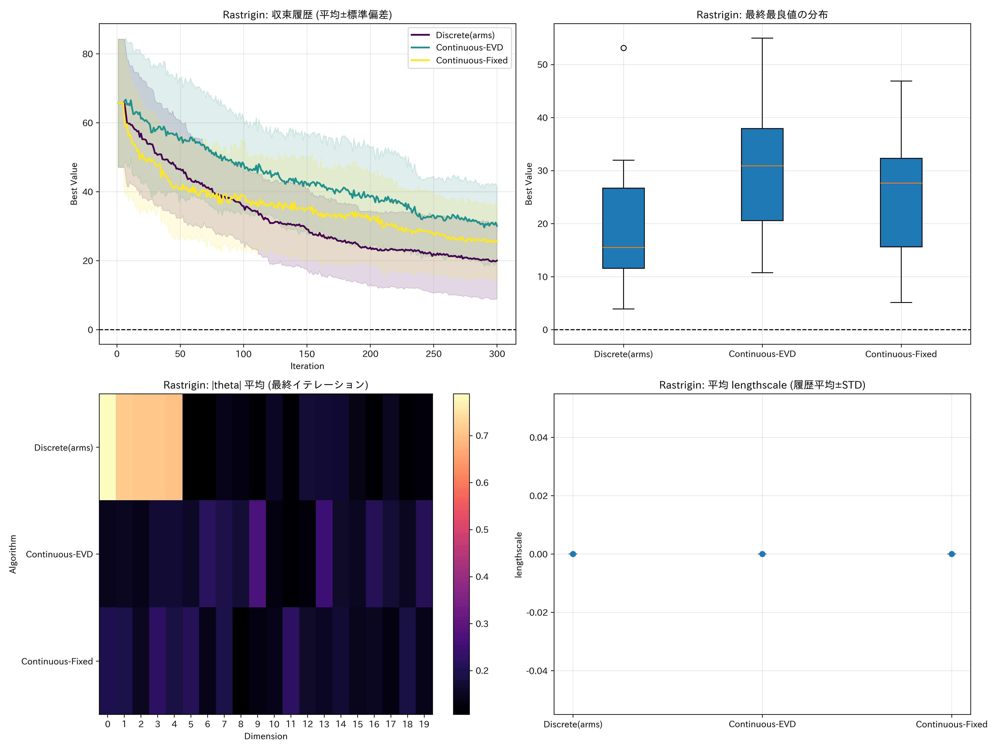

# Arm Selection Comparison Experiment

目的: LinBandit-BO の「方向（アーム）の選択方式」だけを差し替え、性能を比較する。基本的な実験方法・対象関数・出力は `exp/reward_function_comparison/` に準拠する。

- 比較対象（報酬は共通で勾配ベース: `r_vec = |∇μ| / max(L_hat, L_min)`）
  - `Discrete(arms)`: 既存の離散アーム（座標+ランダム）から LinUCB で選択
  - `Continuous-EVD`: 信頼楕円体の原点から最遠点の方向（固有分解+二分探索）
  - `Continuous-Fixed`: 上記の高速近似（固定点反復）

- 共通設定: 入力正規化 GP + RBF(ARD) + 長さスケール下限 `l_min=0.10`（正規化空間）

## 依存関係

- `requirements.txt` を利用（BoTorch, GPyTorch, PyTorch, matplotlib, numpy, pandas など）。

```
python -m venv .venv
source .venv/bin/activate  # Windows: .\.venv\Scripts\activate
pip install -r requirements.txt
```

## 実行

- 既定パラメータ（20 次元, 有効 5 次元, 初期 5, 反復 300, 20 ラン）

```
python3 exp/arm_selection_comparison/run_arm_selection_comparison.py
```

- 環境変数で調整（`reward_function_comparison` と整合）
  - `AS_RUNS` または `RF_RUNS`: ラン数（例: `AS_RUNS=8`）
  - `AS_ITERS` または `RF_ITERS`: 反復回数（例: `AS_ITERS=150`）
  - `AS_ALGS`: 比較アルゴリズムのホワイトリスト（カンマ区切り）
    - 例: `AS_ALGS="Discrete(arms),Continuous-EVD"`
  - `AS_FUNCS` または `RF_FUNCS`: 対象関数のホワイトリスト（`Styblinski-Tang,Rastrigin,Ackley` から選択）

## 出力

- 保存先: `exp/arm_selection_comparison/output_results_arm_selection_comparison/`
  - `F_results.npy`: 反復ごとの最良事後平均履歴（各アルゴリズム × ラン）
  - `F_comparison.png`: 収束曲線（平均±STD）/ 最終値箱ひげ / |θ| ヒートマップ / 平均 lengthscale
  - `F_reward_history.csv`: 次元別報酬の時系列（非負）
  - `F_dimension_summary.csv`: 次元別報酬の統計（mean/std/sum）
  - `F_lhat_history.csv`: L_hat の推移
  - `F_grad_norms.csv`: 生勾配ノルムの推移
  - `F_reward_analysis.png`: 平均報酬推移/有効次元平均報酬/L_hat 推移/勾配ノルム分布
  - `F_diagnostics.png`: 最終 |θ| / 最終 L_hat / 方向ベクトルノルム分布
  - `experiment_metadata.json`: 実験設定

> `F` は `Styblinski-Tang`, `Rastrigin`, `Ackley` の各関数名。

## 再現の注意

- 乱数シードは各ランごとに固定（`run_idx * 100`）。アルゴリズム間は同一シードで比較。
- 方向選択以外の構成（GP, lengthscale 下限, 勾配報酬, L_hat スケーリング, 線上 EI 最適化）は共通。

## 実装メモ

- 厳密解（`Continuous-EVD`）
  - `A = λI + Σ x x^T` の固有分解 `A = U diag(α) U^T` と `h = U^T θ̂` から、
    `g(λ) = Σ α_i h_i^2 /(λ α_i - 1)^2 = β_t^2` を 1 次元二分探索で解き、
    `θ* = U y, y_i = (λ α_i)/(λ α_i - 1) h_i`。方向は `x* = θ*/||θ*||`。
- 高速近似（`Continuous-Fixed`）
  - 固定点反復 `x ← Normalize( θ̂ + β_t A^{-1}x / ||x||_{A^{-1}} )` を 10–50 回程度。
- `LinBandit-BO.py` にも同等の関数（`direction_selection` 引数）を実装済み。

## 期待される傾向（参考）

- 高次元では離散アームの網羅性が不足しやすく、`Continuous-*` が有利になりやすい。
- `Continuous-EVD` は計算が重め（O(d^3)）だが強い基準に、`Continuous-Fixed` は軽量な近似。

---

## 実験結果（本リポ実行, 20 runs × 300 iters, dim=20, 有効5次元）

結論（要約）
- 3 関数すべてで、既存の `Discrete(arms)` が最終最良値（低いほど良い）で優位。
- `Continuous-Fixed` は `Continuous-EVD` より安定だが、今回の条件では `Discrete(arms)` に及ばず。
- `Continuous-*` は L_hat（推定 Lipschitz 尺度）が大きくなりがちで、報酬スケーリングにより更新量が縮小→学習が進みにくい傾向が見られた。

数値サマリ（最終値 平均±標準偏差）
- Styblinski–Tang（最適 −195.83）
  - Discrete(arms): −190.48 ± 5.90
  - Continuous-EVD: −159.40 ± 24.12
  - Continuous-Fixed: −165.45 ± 13.61
- Rastrigin（最適 0）
  - Discrete(arms): 20.03 ± 11.10
  - Continuous-EVD: 30.09 ± 11.19
  - Continuous-Fixed: 25.64 ± 11.01
- Ackley（最適 0）
  - Discrete(arms): 1.87 ± 1.54
  - Continuous-EVD: 3.48 ± 2.46
  - Continuous-Fixed: 3.24 ± 1.69

診断（最終 L_hat の平均）
- Styblinski–Tang: Discrete 186.1 / EVD 356.4 / Fixed 235.2
- Rastrigin: Discrete 171.1 / EVD 963.3 / Fixed 1003.7
- Ackley: Discrete 8.59 / EVD 9.00 / Fixed 5.85

上記より、特に Rastrigin と Styblinski–Tang で `Continuous-*` の L_hat が大きく、
`r_vec = |∇μ| / max(L_hat, L_min)` のスケーリングで報酬が相対的に小さくなり、
線形バンディットの更新（b への加算）が伸びにくかったことが示唆されます。

### 図版（クリック/表示で確認）

Styblinski–Tang
- 収束比較: 
- 報酬解析: 
- 診断: 

Rastrigin
- 収束比較: 
- 報酬解析: 
- 診断: 

Ackley
- 収束比較: 
- 報酬解析: 
- 診断: 

---

## なぜこの結果になったか（考察）

- モデル仮定のミスマッチ
  - 連続最適方向の理論（OFUL/楕円体最遠点）は「線形報酬」r = x^T θ + noise を前提。
  - 本実装の報酬はベクトル `r_vec = |∇μ(x)| / L_hat` を b に逐次加算（方向とは独立に全次元へ配分）。
  - この「方向非依存の多次元報酬」に対し、`θ̂=A^{-1}b` から導く最適方向は、
    しばしば“不確実性（‖x‖_{A^{-1}}）が大きい合成方向”へ寄り、線上 EI と噛み合わないケースが増える。

- 探索線分の有効幅の差
  - 連続方向は多次元に成分を持つため、箱型制約との交差で t の許容域が狭くなりやすい。
  - 座標軸方向（離散）の方が t の可動域が広く、1D-EI が有効に機能しやすい。

- 関数構造との整合
  - 本ベンチ（有効 5 次元・分離型）は座標方向と相性が良い。`Discrete(arms)` は 0.8 の割合で座標方向を含み、
    重要次元の切り出しが早い。
  - 連続方向は成分が分散し、効果のある次元への集中度が下がる。

- L_hat の増大と報酬縮小
  - 実測でも `Continuous-*` は L_hat の平均が大きく、`r_vec` が相対的に縮小。
  - b の更新が進みにくく、`θ̂` が強い方向性を持ちにくい→次ラウンドの方向選択がさらに鈍る負帰還。

- 実装面の注意
  - `Continuous-EVD` は理論的に正しいが、常に良い方向を与えるとは限らない（報酬の設計が異なるため）。
  - `Continuous-Fixed` は EVD より丸め誤差に強いが、上記の構造的要因は解消しない。

## 改善案（今後の検証）

- 報酬と方向の整合性を高める
  - 例: スカラー報酬 `r = |∇μ(x)^T direction|` を用い、`b += r * direction` と更新（線形仮定に整合）。
  - あるいは `r_vec` を方向に射影して加算（全次元配分ではなく方向選好を学習）。

- 方向の疎性／座標成分の強調
  - 連続方向に L1 正則化相当のペナルティを課して座標軸寄りの解を促す。
  - もしくは "座標＋連続" のハイブリッド（各ラウンドで少数の軸方向を混ぜる）。

- 線上最適化の幅・精度調整
  - 方向正規化とともに t 範囲を動的に拡大（安全な範囲で）し、EI のグリッド解像度を適応。

- GP の標準化
  - `Normalize(d)`, `Standardize(1)` の導入で L_hat の暴れを抑制（数値安定性向上）。

