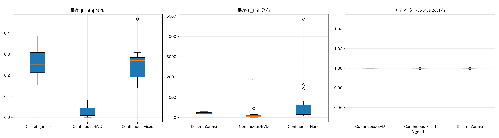

# Arm Selection with Direction-Aligned Reward

目的: `exp/arm_selection_comparison`（方向選択のみの比較）に対し、
報酬を方向と整合する形に変更して比較する。

- 方向選択（三方式: 同一）
  - `Discrete(arms)`: 既存の座標＋ランダムから LinUCB
  - `Continuous-EVD`: 信頼楕円体の原点から最遠点（固有分解＋二分探索）
  - `Continuous-Fixed`: 固定点反復による近似
- 報酬（本実験での差分）
  - `r = |∇μ(x) · direction| / max(L_hat, L_min)`
  - 線形バンディット更新: `b ← b + r · direction`
  - ログ用のベクトルは `|r| · |direction|` を各次元に記録（非負）

## 依存関係 / 準備

`requirements.txt`（BoTorch/GPyTorch/PyTorch 等）に準拠。

```
python -m venv .venv
source .venv/bin/activate  # Windows: .\.venv\Scripts\activate
pip install -r requirements.txt
```

## 実行

- デフォルト（dim=20, 有効5次元, 初期5, 反復300, runs=20）

```
python3 exp/arm_selection_directional_reward/run_arm_selection_directional_reward.py
```

- 環境変数（`arm_selection_comparison` と同様）
  - `AS_RUNS` / `RF_RUNS`: ラン数
  - `AS_ITERS` / `RF_ITERS`: 反復回数
  - `AS_ALGS`: 比較アルゴリズムのホワイトリスト（カンマ区切り）
  - `AS_FUNCS` / `RF_FUNCS`: 対象関数のホワイトリスト

## 出力

- `exp/arm_selection_directional_reward/output_results_arm_selection_directional_reward/`
  - `F_results.npy`: 反復ごとの最良事後平均（各アルゴリズム×ラン）
  - `F_reward_history.csv`: 次元別報酬の時系列（非負）
  - `F_dimension_summary.csv`: 次元別統計
  - `F_lhat_history.csv`, `F_grad_norms.csv`
  - `F_comparison.png`: 収束曲線/箱ひげ/|θ|ヒートマップ/平均 lengthscale
  - `F_reward_analysis.png`: 平均報酬推移/有効次元平均報酬/L_hat 推移/勾配ノルム分布
  - `F_diagnostics.png`: 最終 |θ| / 最終 L_hat / 方向ノルム
  - `experiment_metadata.json`: 設定

> `F` は `Styblinski-Tang`, `Rastrigin`, `Ackley`。

## メモ / 期待

- この報酬では OFUL の方向選択と更新が整合しやすく、
  連続方向（EVD/Fixed）が `arm_selection_comparison` より相対的に有利になる可能性がある。
- ベースライン（Discrete）とどの程度差が縮むかを確認する。

## 図版（実行後に自動出力）

Styblinski–Tang
- 収束: 
- 報酬: 
- 診断: 

Rastrigin
- 収束: 
- 報酬: 
- 診断: 

Ackley
- 収束: 
- 報酬: 
- 診断: 

---

## 結果サマリ（20 runs × 300 iters, dim=20, 有効5次元）

最終最良値（平均）と、序盤（50, 100 iter）の平均値を抜粋（小さいほど良い）。

- Styblinski–Tang（最適 −195.83）
  - Discrete(arms): final −190.33, i50 −135.39, i100 −156.15
  - Continuous-Fixed: final −166.86, i50 −139.74, i100 −162.98
  - Continuous-EVD: final −107.18, i50 −107.18, i100 −107.18

- Rastrigin（最適 0）
  - Discrete(arms): final 19.11, i50 47.42, i100 38.18
  - Continuous-Fixed: final 23.57, i50 40.14, i100 34.41
  - Continuous-EVD: final 63.68, i50 64.81, i100 65.05

- Ackley（最適 0）
  - Discrete(arms): final 2.25, i50 7.33, i100 5.97
  - Continuous-Fixed: final 2.55, i50 5.95, i100 4.81
  - Continuous-EVD: final 7.78, i50 8.12, i100 7.84

補足（最終 L_hat 平均の一例）
- Styblinski–Tang: Discrete 207.2 / Fixed 581.3 / EVD 77.3
- Rastrigin: Discrete 193.3 / Fixed 655.5 / EVD 181.5
- Ackley: Discrete 15.65 / Fixed 6.48 / EVD 238.6

---

## 考察: なぜ Continuous-Fixed は序盤優位で、最終的に Discrete が逆転するのか

- 方向の「疎さ」と箱型制約
  - Continuous-Fixed の方向は多次元に成分を持つ（密）。この場合、線上探索の t 範囲は各次元の境界で同時に制限され、
    座標方向に比べて有効可動域が狭くなりやすい。序盤は広い領域で探索でき優位だが、近傍探索では一歩の伸びが小さくなる。
  - Discrete(arms) は座標軸方向が主で、分離型ベンチとの相性が良く、かつ t 範囲が広いので後半の収束が速い。

- 報酬スケーリングと L_hat の肥大化
  - 本実験の更新は r = |∇μ·direction| / L_eff を b に方向加算（b ← b + r·direction）。
  - Continuous-Fixed は密な方向で勾配が大きくなりがちで、L_hat（推定 Lipschitz）が肥大化。
    L_eff= max(L_hat, L_min) が大きいと r が縮小し、以降の b 更新量が頭打ちになる。
  - 実測でも Rastrigin/Styblinski–Tang で Fixed の最終 L_hat は Discrete より大きく、
    後半の学習が伸びにくい → Discrete に逆転される。

- ARD と方向の整合
  - 本ベンチは有効 5 次元の分離型。座標軸方向は ARD の「重要次元」を素早く強調しやすく、
    後半の exploitation に有利。
  - 密な連続方向は関与しない次元へも動くため、最終局所探索の効率が下がる。

## なぜ Continuous-EVD はさらに悪いのか

- 不確実性項への過度な偏り
  - EVD は理論的最適（OFUL）だが、β_t が大きいと \|x\|_{A^{-1}} の寄与が支配的になり、
    「もっとも不確実な方向」へ偏る。r = |∇μ·direction| はこの方向で小さくなりがちで、b 更新が進まず θ̂ が育たない。
  - 実測でも Ackley の L_hat が極大（≈239）になり、報酬が縮小して停滞。

- 線上探索とのミスマッチ
  - 高不確実方向は箱型制約で t 範囲が極端に狭く、EI グリッドの最大が t≈0 に張り付くことがある。
    Styblinski–Tang では i50 ≈ i100 ≈ final となり、実質的に改善が止まっている。

- 近似解（Fixed）のほうがバランス良い
  - Fixed は θ̂ と A^{-1} の両方を勘案した固定点で、EVD ほど不確実性に寄りきらないため、
    序盤の改善が安定して出やすい。

---

## 改善の方向性

- 方向の疎性を促す正則化（L1 など）や、座標混合のハイブリッド（各ラウンドで軸方向も混ぜる）。
- β_t のスケジューリング（探索→活用で逓減）や、θ̂ 寄与を強める重み付けで EVD を緩和。
- L_hat の抑制（移動平均での正規化やクリッピング）で後半の報酬縮小を緩和。
- ARD に合わせた空間の前処理（lengthscale で白色化）後に方向選択を行う。
