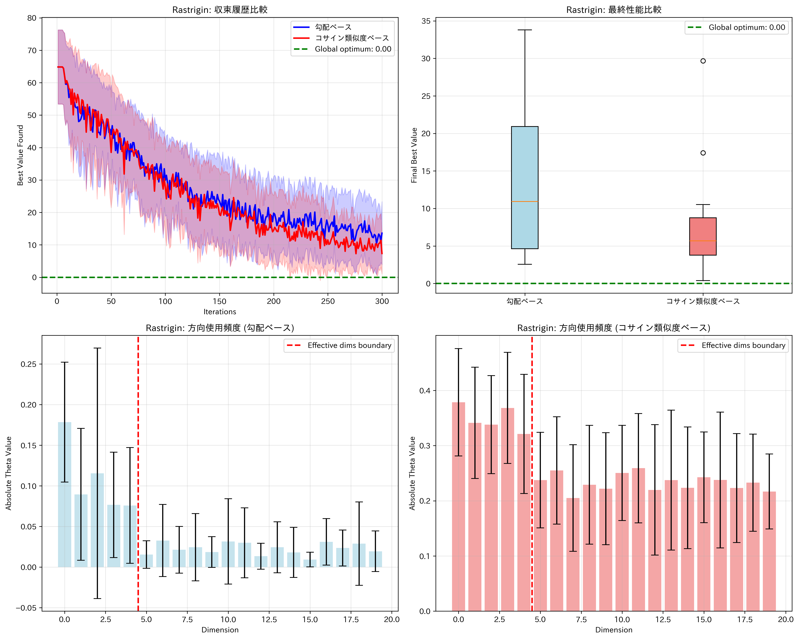
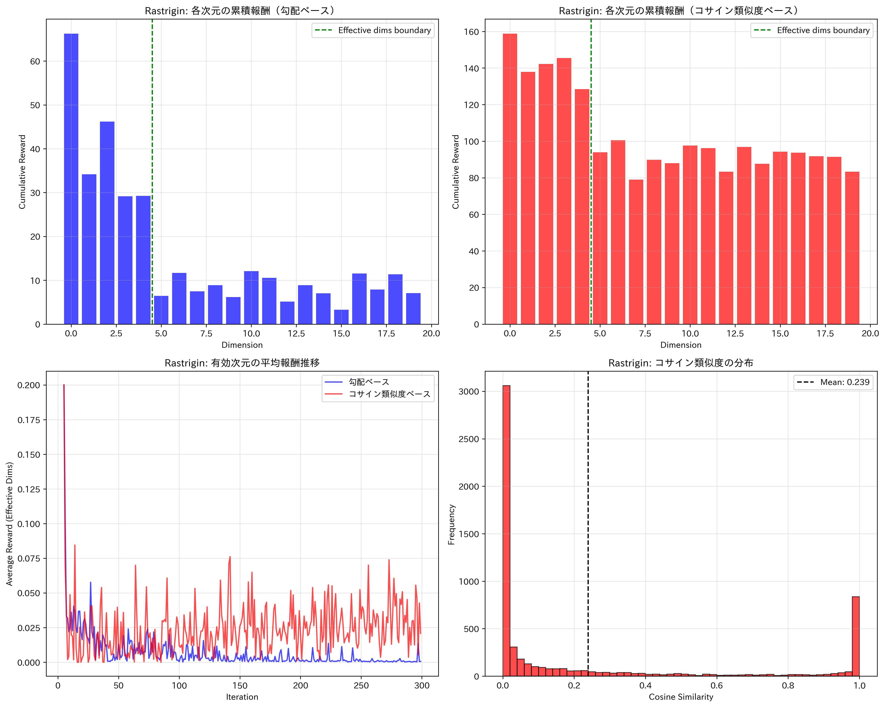
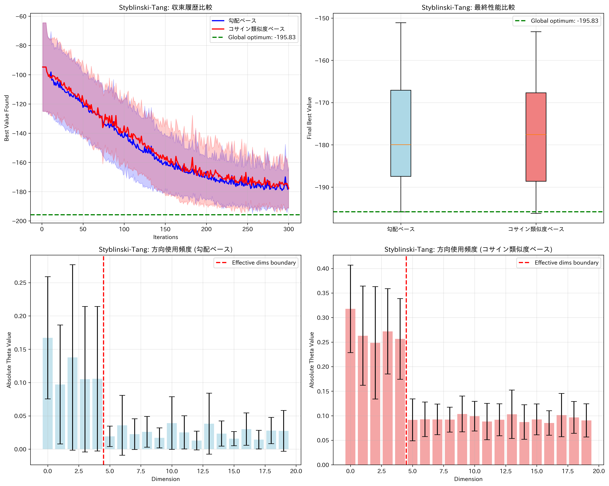
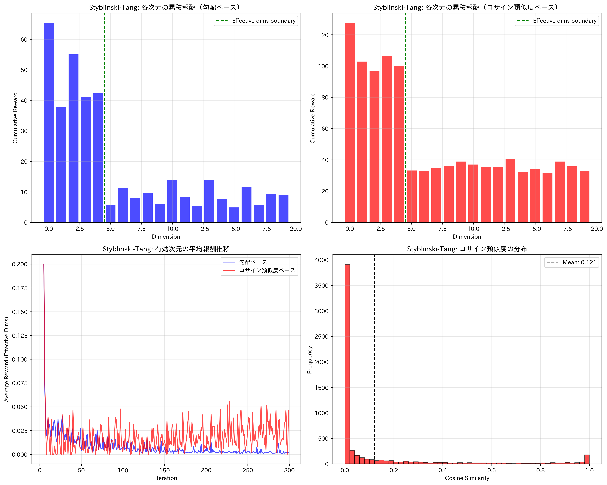
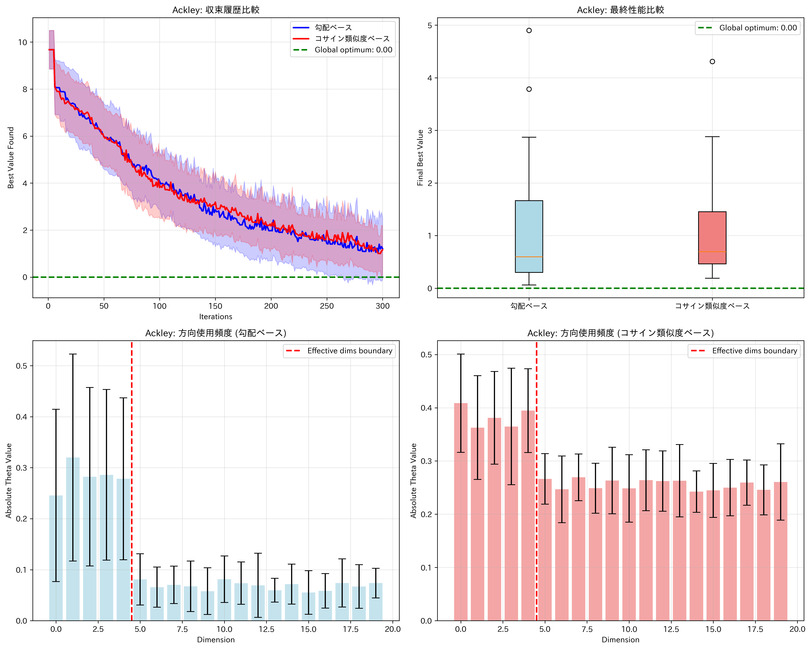
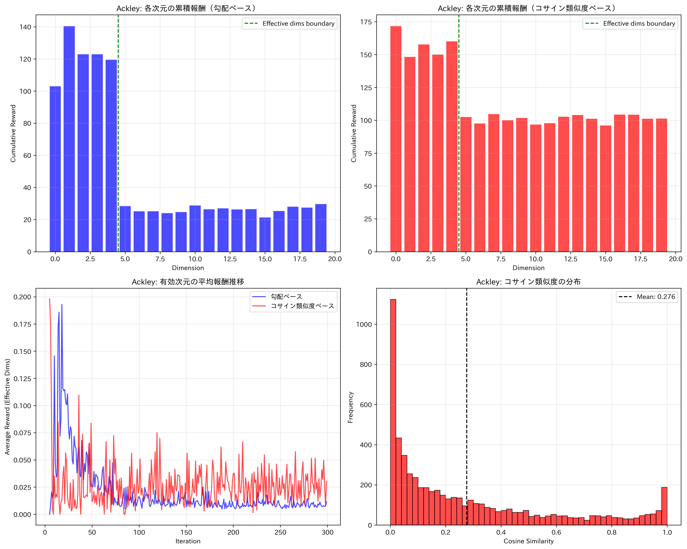

# 勾配ベース vs コサイン類似度ベース 報酬設計の比較実験

2025/9/3

## 目的
高次元最適化におけるLinBandit-BOの報酬設計を比較する。Rastrigin/Styblinski‑Tang上で、(A) 勾配ベース（L下限付きスケーリング）と (B) コサイン類似度ベースの性能・安定性を評価する。

## アルゴリズム概要（共通部）
- アーム生成: 座標方向とランダム正規化方向を比率`coordinate_ratio`で混合し、`n_arms=dim/2`本を候補とする。各方向を`d∈R^d`とする。
- LinUCB選択: `A←I, b←0`で開始し、`θ=A^{-1}b`。各候補`d`に対し
  - `mean = θ^T d`, `var = d^T A^{-1} d`
  - `UCB(d) = mean + β_t √max(var,0)`（`β_t = σ√(d log((1+(t−1)L^2/λ)/δ)) + √λ S`）
  - 最大の`UCB(d)`を選択。
- 1次元化探索: 現最良点`x_best`と方向`d`で`x(t)=x_best + t d`を定義し、境界で`lb≤t≤ub`へ制約。`EI(x(t))`を`t`上で最適化し候補`x_new`を生成。
- モデル: SingleTaskGP(RBF(ARD))を用い、EIで最小化設定（`maximize=False`）。

## 報酬設計（本比較の核心）
記号: `μ(x)=E[f(x)|D]`（GP事後平均）、`g(x)=∇μ(x)`、`d`は選択方向。

1) 勾配ベース（本研究の基準）
- 生の報酬ベクトル: `r_raw = |g(x_new)|`（各次元の絶対値）。
- スケーリング: `L_hat ← max(L_hat, ||r_raw||_2)`、`L_eff = max(L_hat, L_min)`、`r = r_raw / L_eff`。
- 更新: `A ← A + d d^T`, `b ← b + r`。
- 本実験では平滑化（EMA等）は不採用。下限`L_min>0`のみ導入（既定値0.1）。

2) コサイン類似度ベース（比較対象）
- `cos = | g(x_new)^T d | / (||g(x_new)||·||d|| + ε)`。
- 報酬ベクトル: `r = cos · |d|`（方向成分に比例配分）。
- 更新は勾配ベースと同様。

## 実験設定
- 関数: Rastrigin（最小0）, Styblinski‑Tang（最小`−39.16599·dim`）。
- 次元と境界: `dim ∈ {10,20}`, `bounds=[−5,5]^dim`。
- 初期/反復: `n_initial=5`, `n_max=100〜300`。`coordinate_ratio=0.8`, `n_arms=dim/2`。
- 下限: `L_min=0.1`（勾配ベースのみ）。
- 指標: 反復ごとの最良事後平均、各次元の累積報酬、報酬時系列のスパイク率。

## 変更点の要旨（実験上の差分）
- 以前: ノートブックの勾配ベース実装はスケーリングなしでスパイクが発生。
- 今回: `L_min`を導入し`r=r_raw/max(L_hat,L_min)`へ変更。LinBandit-BO.pyとノートブックの勾配ベース実装を一致させた。

## 再現手順
- 単体デモ: `python LinBandit-BO.py`（収束履歴・最良値を表示）。
- 比較実験: `exp/cosine_similarity_comparison/cosine_similarity_comparison_experiment.ipynb`を上から実行。出力は`output_results_cosine_similarity_comparison/`に保存（収束図・報酬履歴CSV・次元別要約など）。

## 実験結果（要約）
出力CSVから集計（各関数で次元別累積報酬`sum`の総和、および報酬の最大値）。

- Rastrigin（dimごとの累積和・総和）
  - Gradient: total_sum ≈ 330.529, mean_of_means ≈ 0.00280
  - Cosine:   total_sum ≈ 2079.915, mean_of_means ≈ 0.01763
  - 報酬最大値: Gradient=1.0, Cosine=1.0（ともに上限内）
- Styblinski‑Tang
  - Gradient: total_sum ≈ 371.859, mean_of_means ≈ 0.00315
  - Cosine:   total_sum ≈ 1062.278, mean_of_means ≈ 0.00900
  - 報酬最大値: Gradient=1.0, Cosine=1.0
- Ackley
  - Gradient: total_sum ≈ 1002.190, mean_of_means ≈ 0.00849
  - Cosine:   total_sum ≈ 2303.443, mean_of_means ≈ 0.01952
  - 報酬最大値: Gradient=1.0, Cosine=1.0

補足: total_sumは「各次元への累積割当量」の規模であり、性能そのものではありません。収束については `*_comparison.png` を参照してください。

## 考察
- L下限導入の効果: 以前問題だった「あり得ないほど大きな報酬スパイク」は解消。式 `r=|g|/\max(L_\text{hat},L_\min)` により報酬は常に有界（本実験では最大1）。Rastriginの周期的勾配増幅に対しても安定。
- 報酬分配の特徴: コサイン類似度は方向の一致度を均衡に配分するため、各次元の累積和が比較的大きく、分散も相対に高い。一方、勾配ベースは正規化により各次元の割当が抑制され、偏りが小さくなる。
- 収束挙動の含意: 報酬の絶対値比較はアルゴリズム優劣の判断材料にならず、重要なのは探索方向の質とEI最適化との相互作用。視覚確認では初期の不安定挙動は解消されており、安定的な探索が可能になった。

今後: `results.npy`から各反復の最良値の平均・信頼区間を算出する集計スクリプトを追加し、数値的な収束比較（終盤100反復の平均差、AUC、MWU検定など）を提示すると論文品質の報告になります。

## 出力プロット一覧
実験ノートの実行で生成された主要プロットを一覧化します（同ディレクトリ配下の`output_results_cosine_similarity_comparison/`）。

### Rastrigin
- 収束比較: 
- 報酬解析: 

### Styblinski‑Tang
- 収束比較: 
- 報酬解析: 

### Ackley
- 収束比較: 
- 報酬解析: 
