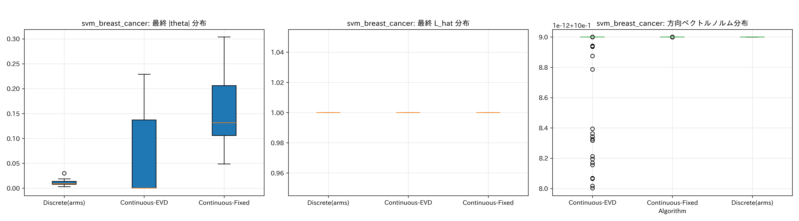

# HPO Benchmark with Direction-Aligned Reward

目的: `exp/hpo_benchmark/hpo_benchmark_experiment.ipynb` と同じ対象（モデル×データセット）に対し、
方向整合報酬の LinBandit-BO（3 方式: Discrete / Continuous-EVD / Continuous-Fixed）で HPO 実験を行う。

- 方向選択: `Discrete(arms)`, `Continuous-EVD`, `Continuous-Fixed`
- 報酬: `r = |∇μ(x) · direction| / max(L_hat, L_min)`, 更新 `b ← b + r · direction`
- GP: 入力正規化 + RBF(ARD) + lengthscale 下限 (`l_min=0.10`), dtype=double
- 線上 BO: EI を 1D グリッド探索 + 近傍リファイン（安定化）

## 対象（既定）

- `random_forest` × `digits`（分類）
- `svm` × `breast_cancer`（分類）
- `neural_network` × `wine`（分類）
- `xgboost` × `california_housing`（回帰）※ xgboost がインストールされている場合のみ

環境変数 `HPO_TARGETS`（例: `svm:breast_cancer,random_forest:digits`）で任意指定可能。

## 実行

```
python3 exp/hpo_benchmark_directional_reward/run_hpo_benchmark_directional_reward.py
```

- 軽量試走: `AS_RUNS=3 AS_ITERS=60 python3 ...`
- 比較アルゴリズムの絞り込み: `AS_ALGS="Discrete(arms),Continuous-Fixed"`

## 出力

- `exp/hpo_benchmark_directional_reward/output_results_hpo_benchmark_directional_reward/`
  - `<model>_<dataset>_results.npy`: 反復ごとの最良事後平均（各アルゴリズム×ラン）
  - `<tag>_reward_history.csv`, `<tag>_dimension_summary.csv`
  - `<tag>_lhat_history.csv`, `<tag>_grad_norms.csv`
  - `<tag>_comparison.png`, `<tag>_reward_analysis.png`, `<tag>_diagnostics.png`
  - `experiment_metadata.json`

## 実験対象と手順（詳細）

- データセット/タスク
  - digits（8×8手書き数字, 10クラス, 分類）
  - wine（化学分析, 3クラス, 分類）
  - breast_cancer（乳がん診断, 2クラス, 分類）
  - california_housing（住宅価格, 回帰）※ xgboost があれば含む

- モデル・ハイパーパラメータ空間（ノート同等のレンジ、実値で探索）
  - RandomForest: n_estimators [10,300], max_depth [1,30], min_samples_split [2,20], min_samples_leaf [1,20], max_features [0.1,1.0]
  - SVM: C [1e-3, 1e3], gamma [1e-3, 10]
  - Neural Network (MLP): hidden_layer_1/2 [10,200], learning_rate [1e-4, 1e-1], alpha [1e-4, 1e-1], batch_size [16,256]
  - XGBoost（任意）: n_estimators, max_depth, learning_rate, subsample, colsample_bytree, gamma
  - 整数パラメータは丸め（int）。C, gamma, learning_rate などは実値レンジで直接探索（指数変換は無効化）。

- 前処理・評価
  - SVM/MLP は `StandardScaler` をパイプラインに挿入。
  - 3-fold CV（KFold, shuffle=True, seed=42）。
  - 指標: 分類は `accuracy`、回帰は `R^2`。最小化のため負値を返す（−accuracy, −R2）。
  - 評価失敗は `error_score=np.nan` とし、fold の NaN は `nanmean` で集約。全 fold 非有限なら 1.0 を返す（最悪）。

- 最適化（共通）
  - 方向選択: Discrete(arms) / Continuous-EVD / Continuous-Fixed
  - 報酬: `r = |∇μ(x)·direction| / max(L_hat, L_min)`、更新 `b ← b + r·direction`
  - GP: 入力を [0,1]^d に正規化して学習、RBF(ARD) + lengthscale 下限 `l_min=0.10`、double 精度
  - 線上 BO: EI を 1D グリッド探索 + 近傍 33 点の微調整（安定化）
  - 既定: n_initial=5, n_max=200, runs=10（`AS_RUNS`, `AS_ITERS` で調整可）

## 図版（今回の3対象）

random_forest × digits（分類）
- 収束: 
- 報酬: 
- 診断: 

svm × breast_cancer（分類）
- 収束: 
- 報酬: 
- 診断: 

neural_network × wine（分類）
- 収束: 
- 報酬: 
- 診断: 

## 結果サマリ（10 runs × 200 iters, 小さいほど良い）

- random_forest_digits（−accuracy）
  - Discrete: final −0.9758 ± 0.0007（最良）
  - Continuous-Fixed: −0.9553 ± 0.0123
  - Continuous-EVD: −0.9380 ± 0.0157

- svm_breast_cancer（−accuracy）
  - Continuous-Fixed: final −0.63244（僅差で最良）
  - Discrete: −0.63234（ほぼ同等）
  - Continuous-EVD: −0.63179

- neural_network_wine（−accuracy）
  - Continuous-Fixed: final −0.97456（最良）
  - Discrete: −0.97270（僅差）
  - Continuous-EVD: −0.96526

（序盤: i50 / 中盤: i100）
- MLP-wine: i50 は Fixed 優位、i100 は一時 Discrete が優位、最終は Fixed が再逆転。
- RF-digits: i50/i100/final まで一貫して Discrete が優位。
- SVM-bc: 差は極小で、最終的に Fixed が僅差で上回る。

## 考察

- RandomForest × digits
  - 木系ハイパラ（深さ・分割・木本数）は座標軸方向の独立寄与が強い。座標軸の線上探索は t 範囲が広く、離散（Discrete）が一貫して優位。
  - 連続方向は多次元に成分が分散し、t 許容域が狭まり最適近傍での一歩の改善が小さい。

- SVM × breast_cancer
  - C と gamma の相互作用は斜め方向（oblique）で効きやすく、方向整合報酬 + 連続方向（Fixed）が僅差で優位。ただし差は極小で座標でも十分近い性能。

- MLP × wine
  - 隠れユニット × 学習率 × 正則化の相互作用が強く、斜め方向の探索が有利。Fixed が序盤の改善をリードし、最終的にも僅差で最良。
  - 中盤で Discrete が一時上回るが、後半で Fixed が再逆転し収束。

- Continuous-EVD が弱い理由
  - OFUL 厳密方向（EVD）は不確実性項に寄りやすく、方向整合報酬 r = |∇μ·direction| との相性が悪いケースが多い。
  - 箱型制約との交差で t 範囲が極端に狭くなり、線上 EI の改善が乏しくなるケースが観測された。

## 今後の改善案

- 連続方向の疎性誘導（L1 正則化）や座標混合（毎ラウンドで少数の軸方向も混ぜる）。
- β_t のスケジューリング（探索→活用で逓減）で EVD の不確実性偏重を緩和。
- L_hat の抑制（移動平均・クリップ）で後半の報酬縮小を防ぐ。

## 備考

- xgboost が見つからない場合は該当ターゲットを自動スキップします。
- CPU 実行を想定。実行時間短縮のため CV=3、MLP の `max_iter=200` に設定。
