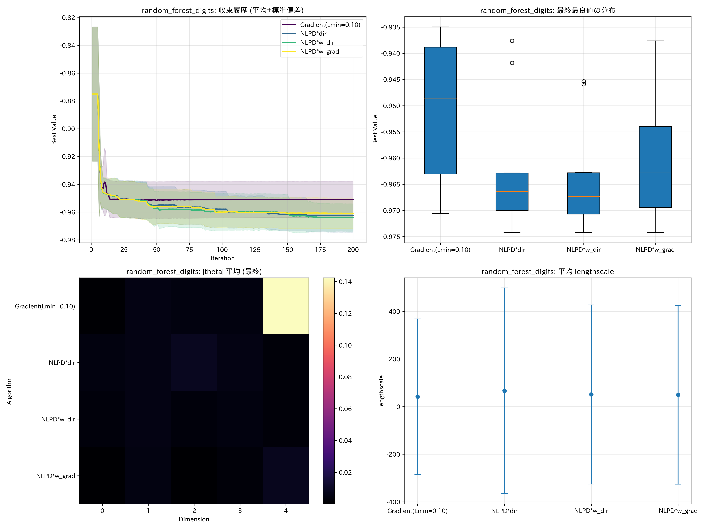
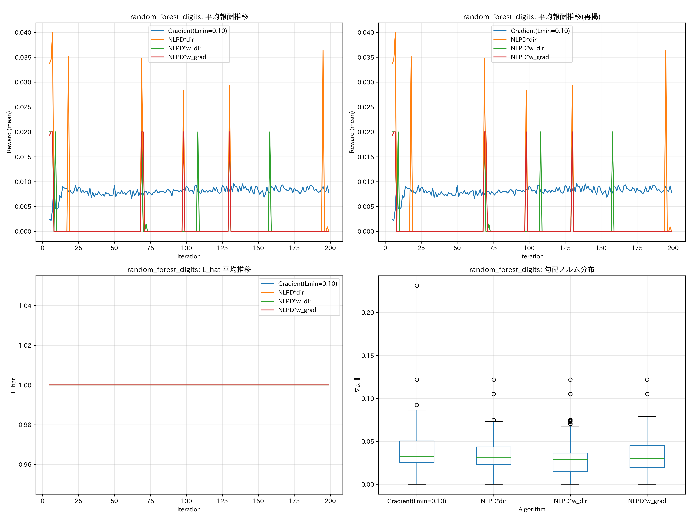
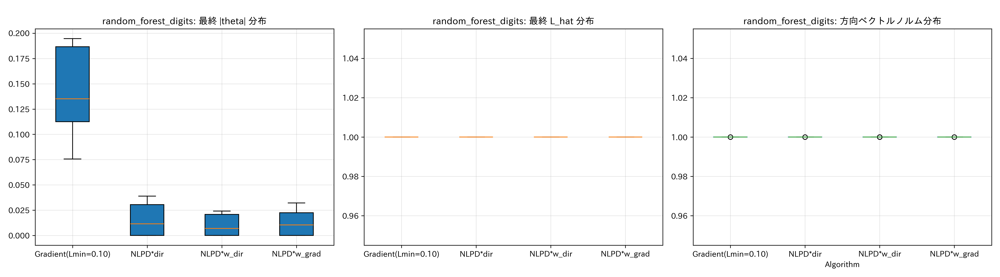
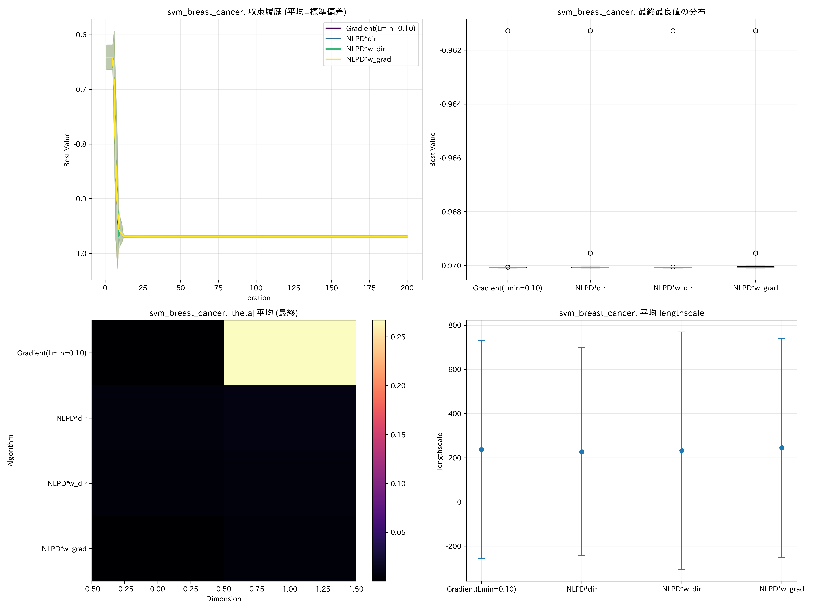
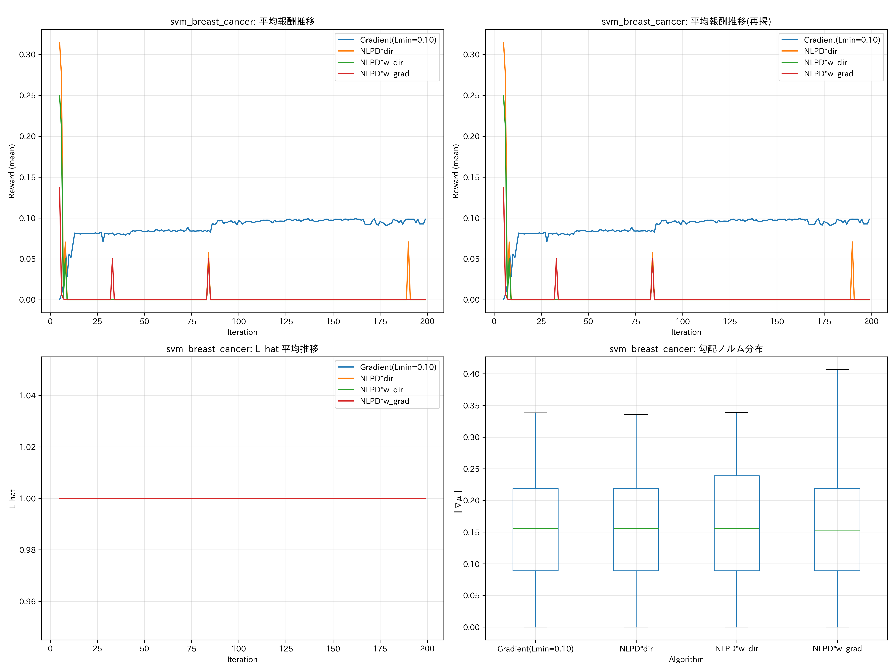
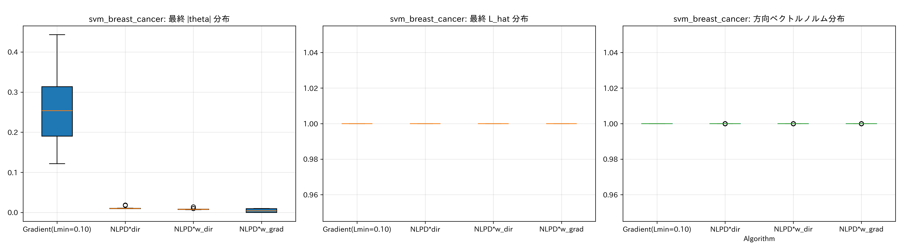
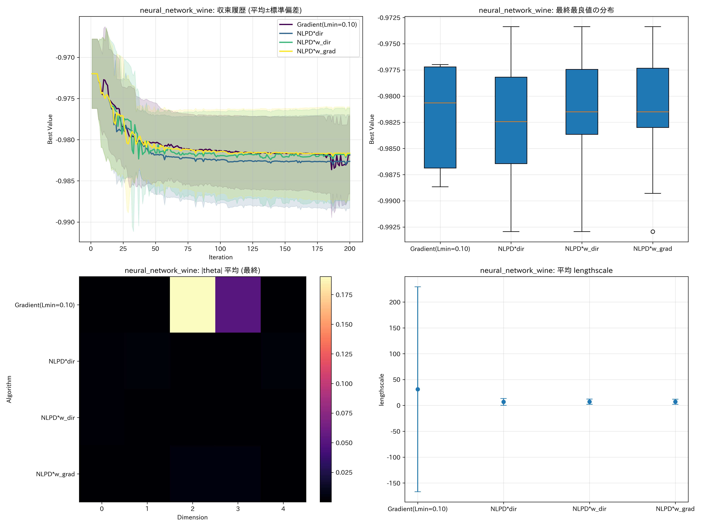
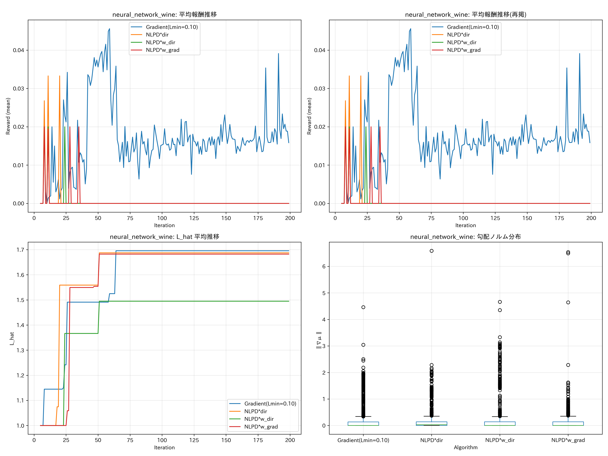
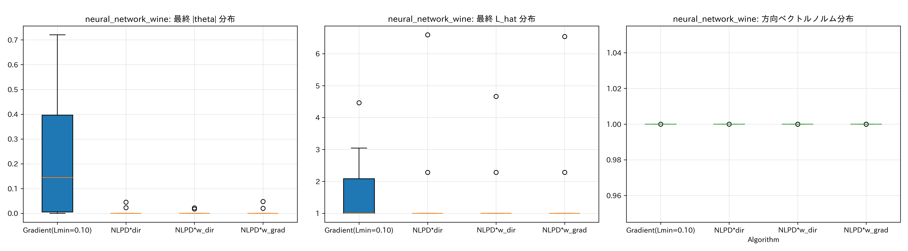

# HPO Benchmark: Reward Function Comparison (Continuous‑Fixed Direction)

本実験は、方向選択を Continuous‑Fixed（固定点反復）に固定し、報酬設計を以下の4方式で比較する。

- Gradient(Lmin=0.10)
- NLPD*dir
- NLPD*w_dir
- NLPD*w_grad

対象のベンチマークは、`exp/hpo_benchmark_directional_reward` と同等（RF×digits / SVM×breast_cancer / NN×wine／任意で XGB×california_housing）。
出力のフォーマット（PNG/CSV/NPY）および図版は同実験に準拠する。

## 実行方法

- 既定（全ターゲット）
  - `python exp/hpo_benchmark_reward_function_comparison/run_hpo_benchmark_reward_function_comparison.py`
- ラン数・反復数の調整
  - `AS_RUNS=5 AS_ITERS=150 python ...`
- 対象の絞り込み
  - `HPO_TARGETS='svm:breast_cancer,random_forest:digits' python ...`
- 報酬方式の絞り込み（カンマ区切り）
  - `RF_REWARD_ALGS='Gradient(Lmin=0.10),NLPD*dir' python ...`

## 実験条件（共通）

- 方向選択: Continuous‑Fixed（OFUL 停留条件の固定点反復）
- 線上探索: EI を 1D グリッド + 局所 33 点で安定最適化
- GP: 入力を [0,1]^d に正規化、`SingleTaskGP + RBF(ARD)`、lengthscale 下限 `l_min=0.10`、double 精度
- HPO 評価: 3-fold CV（分類は accuracy、回帰は R^2）。最小化のため −accuracy / −R^2 を最適化
- 既定: `n_initial=5, n_max=200, n_runs=10`

## 生成物

ターゲットごとに以下を `output_results_hpo_benchmark_reward_function_comparison/` に出力する。

- `*_results.npy`: 反復ごとの最良値の履歴（アルゴリズム×ラン）
- `*_comparison.png`: 収束・最終値・|theta|ヒートマップ・average lengthscale
- `*_reward_analysis.png`: 平均報酬の推移、L_hat の推移、勾配ノルム分布
- `*_diagnostics.png`: |theta|・L_hat・方向ベクトルノルムの診断
- `*_reward_history.csv`, `*_dimension_summary.csv`, `*_lhat_history.csv`, `*_grad_norms.csv`
- `*_experiment_metadata.json`

## 図版（サンプル）

random_forest × digits（分類）
- 収束: 
- 報酬: 
- 診断: 

svm × breast_cancer（分類）
- 収束: 
- 報酬: 
- 診断: 

neural_network × wine（分類）
- 収束: 
- 報酬: 
- 診断: 

xgboost × california_housing（回帰、任意）
- 収束: 
- 報酬: 
- 診断: 

## 注意点・補足

- Continuous‑Fixed は不確実性方向へも成分を持つため、線上の許容 t 範囲が狭くなるケースがある。グリッド + 局所微調整で EI 評価の安定性を担保している。
- NLPD 系報酬は EMA 正規化でスケールを抑制し [0,1] にクリップ。勾配報酬は `L_hat` により正規化しクリップ。
- xgboost は環境にインストールがない場合は自動スキップされる。
