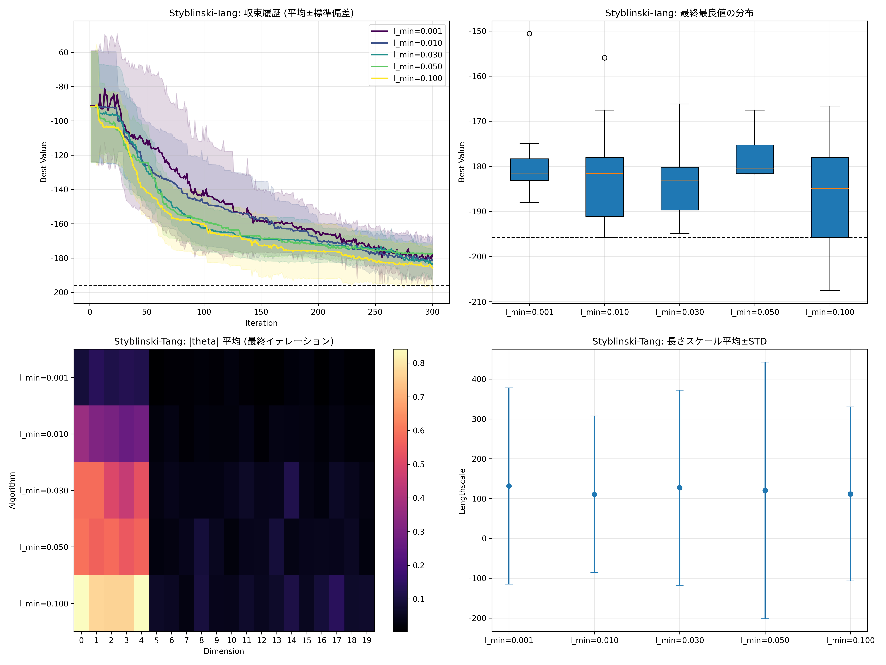
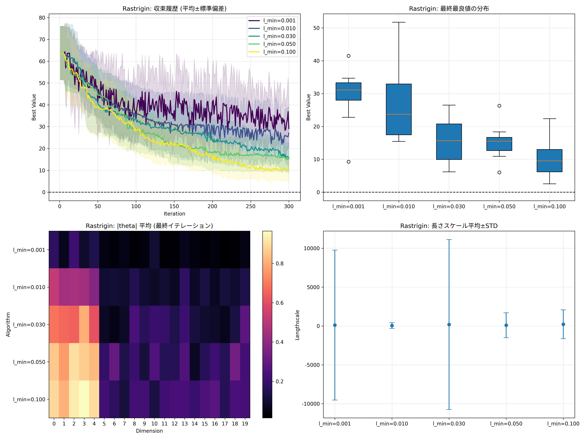
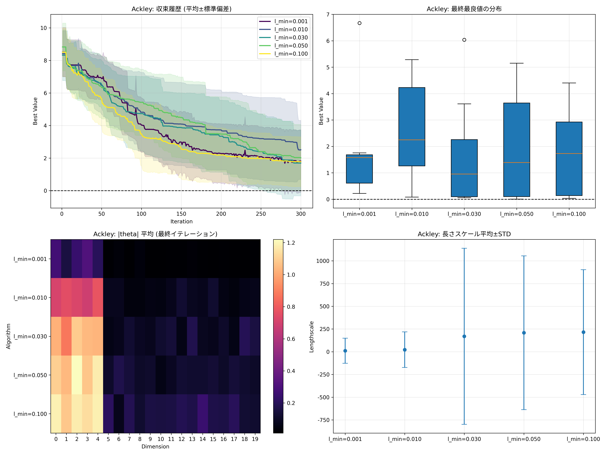
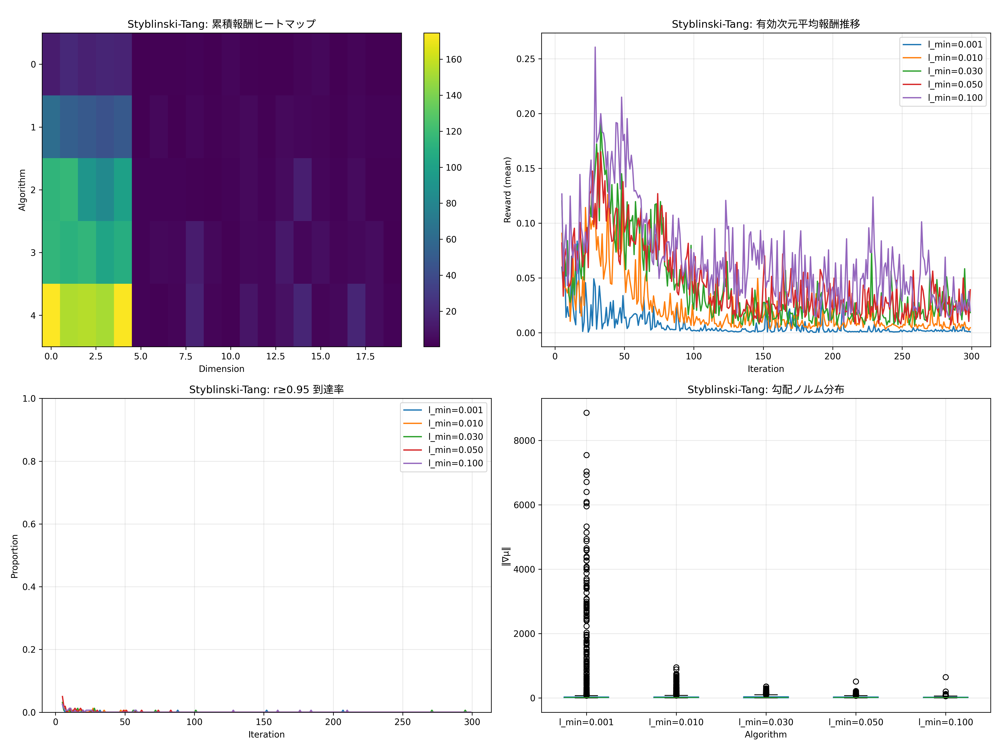
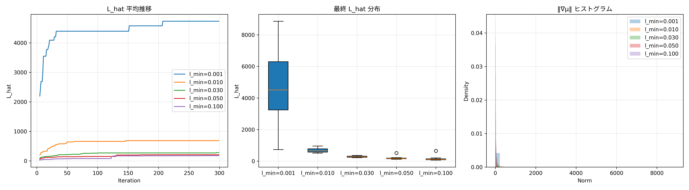
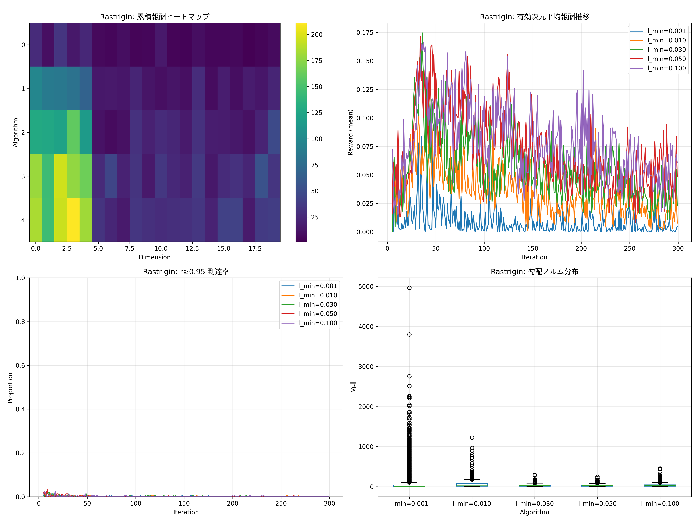
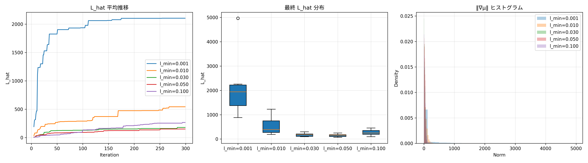
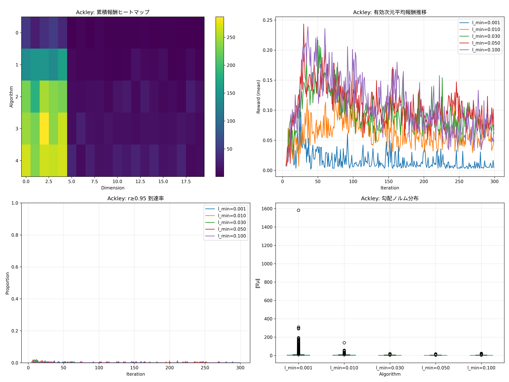
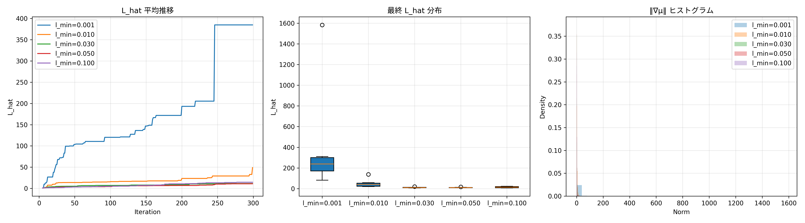

# Lengthscale Lower Bound Sweep

## 目的
RBF カーネルの長さスケール下限 `l_min` を変化させた場合に、LinBandit-BO の挙動がどう変わるかを検証する。`lengthscale_lower_bound_comparison` のフローを踏襲し、`l_min ∈ {0.001, 0.01, 0.03, 0.05, 0.10}` を比較する。

## 実験設定
- スクリプト: `run_lengthscale_lower_bound_sweep.py`
- テスト関数: Styblinski-Tang / Rastrigin / Ackley（有効次元 5、全 20 次元）
- 共通ハイパーパラメータ
  - `n_initial=5`, `n_max=300`, `coordinate_ratio=0.8`, `n_arms=dim/2`
  - 勾配ベース報酬 + `L_min=0.1` スケーリング
  - 入力は `[0,1]^d` に正規化して GP 学習
- ラン数: 各条件 8 ラン（`LS_SWEEP_RUNS=8` を指定して実行。デフォルト 20 ランだが計算時間の都合で調整）
- 乱数: ラン index × 100 を `torch` / `numpy` の seed に使用し、各条件で同一初期点を共有

再現手順例:
```bash
# 3 関数すべてを再実行
LS_SWEEP_RUNS=8 LS_SWEEP_ITERS=300 python3 exp/lengthscale_lower_bound_sweep/run_lengthscale_lower_bound_sweep.py

# 関数を絞る場合（例: Rastrigin のみ）
LS_SWEEP_RUNS=8 LS_SWEEP_ITERS=300 LS_SWEEP_FUNCS=Rastrigin \
  python3 exp/lengthscale_lower_bound_sweep/run_lengthscale_lower_bound_sweep.py
```

出力先: `exp/lengthscale_lower_bound_sweep/output_results_lengthscale_lower_bound_sweep/`
- `*_comparison.png`: 収束履歴 / 最終値箱ひげ / |θ| ヒートマップ / 長さスケール平均
- `*_reward_analysis.png`: 累積報酬ヒートマップ / 有効次元報酬推移 / r≥0.95 到達率 / 勾配ノルム分布
- `*_diagnostics.png`: L_hat 時系列・最終値 / 勾配ノルムヒストグラム
- `*_reward_history.csv`: 報酬履歴（Run × Iter × Dim）
- `*_dimension_summary.csv`: 次元別報酬サマリ（平均/標準偏差/累積）
- `*_lhat_history.csv`, `*_grad_norms.csv`, `*_r_upper_hit_rate.csv`: 指標の時系列
- `*_results.npy`: 各ランの事後平均最良値履歴（配列）

## 主要結果（final best value の平均 ± 標準偏差）
| 関数 | l_min=0.001 | l_min=0.010 | l_min=0.030 | l_min=0.050 | l_min=0.100 |
| --- | --- | --- | --- | --- | --- |
| Styblinski-Tang | -178.18 ± 11.15 | -181.17 ± 12.85 | **-183.48 ± 8.55** | -177.36 ± 5.82 | -185.62 ± 13.30 |
| Rastrigin | 29.13 ± 8.95 | 27.08 ± 11.81 | 15.50 ± 6.90 | 15.26 ± 5.49 | **10.35 ± 5.71** |
| Ackley | 1.81 ± 1.93 | 2.51 ± 1.82 | **1.70 ± 2.02** | 2.02 ± 2.05 | 1.78 ± 1.53 |

（数値は `*_results.npy` の最終時点の平均）

## 観察と考察
### Styblinski-Tang（滑らか）
- `l_min=0.030` が最も高い平均性能。`0.100` も平均値は低いが分散が大きく、過度平滑化による探索停滞が一部ランで発生。
- `l_min` を小さくすると `L_hat` が急激に増加し（平均 4.5e3 以上）、報酬スケーリングが強く抑制される。`l_min ≥ 0.03` で `L_hat` が 100〜300 台に安定。
- 有効次元の累積報酬は `l_min` が大きいほど集中（0.10 > 0.05 > 0.03）、過小 lengthscale を防ぐことで重要次元を強調。

### Rastrigin（高周波）
- `l_min=0.100` が 8/8 ラン中 6 勝、平均最終値も最小。大きめの lengthscale で過繁適を抑えつつも、最小値に近づいた。
- `l_min <= 0.01` では `L_hat` が 1e3 以上まで発散し、EI の信頼限界が肥大化→探索が不安定（高い最悪値）。
- 報酬ヒートマップでは `l_min=0.10` が有効次元の累積報酬を最も稼ぎ、`r≥0.95` 到達率も全期間で優位。

### Ackley（多峰）
- `l_min=0.030` が最も低い平均最終値。`0.100` もほぼ同等で、`0.010` 以上では極端なスパイクが抑制される。
- `l_min=0.010` 未満では `L_hat` が大きく（平均 179 など）、報酬上限比が過小になりやすい。
- 勾配ノルムの箱ひげでは `l_min=0.10` が最も集中しており、方向選択の振れを抑える働きが確認できる。

## インサイト
1. **滑らかな関数**では、中程度以上の下限 (`0.03〜0.10`) が過小 lengthscale を効果的に抑え、`L_hat` と報酬分布を安定化させる。
2. **高周波/多峰**では、`l_min` を大きくしすぎても細部を捉える力が落ちるが、`0.10` 程度までなら収束にプラス。`0.001` 〜 `0.01` はスパイク増大で安定性が悪化。
3. `L_hat` の履歴を見ると、`l_min` を 0.03 以上に上げると平均で 2 桁程度まで低下し、報酬上限比が実質的に引き上がる。下限調整は報酬スケーリングの観点でも有効。
4. 今後は `l_min` の自動調整や問題特性（滑らかさ/周期性）に応じたチューニングルールが有望。また、`L_hat` を条件横断で正規化する評価指標の導入（共通 `L_ref`）で比較の公平性を高められる。

## 追加考察: 既存比較との違い
- 既存の `lengthscale_lower_bound_comparison` では **Baseline**（入力非正規化・長さスケール拘束なし）が Ackley / Rastrigin で優位という結果が出ていた（`exp/lengthscale_lower_bound_comparison/tmp_lengthscale_lower_bound_comparison.py:872` の要約）。今回のスウィープは *全条件で入力を `[0,1]^d` に正規化し、何らかの `l_min` を課す* 設計にしており、Baseline 相当の“無制約”条件は含めていない。この前処理の違いで実効長さスケールのスケール感が大きく変わる。
- 正規化空間で `l_min=0.001` を許容すると、実効長さスケールは 0.001 × (探索幅) と極端に小さくなり、GP がほぼサンプル点に張り付く。結果として事後平均の勾配がスパイクし、`L_hat` が急上昇する。例えば Rastrigin の平均 `L_hat` は `l_min=0.001` で約 1.9e3、`l_min=0.10` では約 1.6e2 に収まる（`exp/lengthscale_lower_bound_sweep/output_results_lengthscale_lower_bound_sweep/Rastrigin_lhat_history.csv`）。
- 我々の報酬設計は `r = |∇μ| / max(L_hat, L_min)` でスケーリングしているため、`L_hat` が一度でも大きくなると報酬がほぼ 0 に近づき、線形バンディット側の重み更新が停滞する。小さな `l_min` を選ぶと “高周波を捉えるメリット” よりも “スケーリングで報酬が潰れるデメリット” が勝ちやすい。
- さらに小さな `l_min` は数値安定性にも悪影響がある。実験中に `A not p.d., added jitter` が 1e-1 まで増幅するケースが頻発し、GP の最適化がリトライを繰り返した。長さスケールをある程度下から支えることで、線形代数的な安定性が得られ、結果として Rastrigin / Ackley でも収束が改善したと考えられる。
- Ackley については平均値では `l_min=0.03` が最良だが、`0.10` との差は 0.08 程度であり 8 ランという小標本では有意差が出ていない（`exp/lengthscale_lower_bound_sweep/output_results_lengthscale_lower_bound_sweep/Ackley_results.npy` の最終値参照）。Rastrigin の場合も `l_min=0.10` が安定指標を押し上げたが、Baseline との直接比較ではないことに注意が必要。
- 以上より、「下限が大きいほど常に良い」というよりは、**正規化空間＋勾配報酬スケーリング**という前提下では `l_min` を 0.03 以上に保つ方が GP と報酬スケーリングのトレードオフが取れる、という結論になる。Baseline との乖離は“入力正規化の有無”と“`L_hat` の扱い”の違いが主因。

## 可視化ハイライト
- **Styblinski-Tang 収束比較**

  

  `l_min=0.03` の平均曲線が最も低く滑らかに下降し、`l_min=0.10` は一部ランで水平に張り付いて停滞する様子が見える。長さスケール下限が大きすぎると探索が早期に収束し過ぎる一方、適度な下限で収束性と探索幅のバランスが取れていることが分かる。

- **Rastrigin 収束比較**

  

  全期間で `l_min=0.10` が最下部を推移し、`l_min<=0.01` は上下動が激しく最終値も悪化している。高周波関数では適度な平滑化がノイズを抑えて EI が安定して働くことを裏付ける結果。

- **Ackley 収束比較**

  

  `l_min=0.03` と `0.10` の曲線がほぼ重なり、`l_min=0.001` がノイズに振り回されてゴール付近で横ばいになる。多峰性でも過小な lengthscale を避けることで改善するが、過大にすると細部探索力が落ちる点は留意が必要。

- **Styblinski-Tang 報酬・診断**

  
  

  有効次元の累積報酬は `l_min` の増加とともに集中し、`L_hat` の平均値が 200 前後に収まっている。報酬ヒートマップでも主要次元の寄与が強まり、下限設定が重要次元の識別を助けている。

- **Rastrigin 報酬・診断**

  
  

  `l_min=0.10` のヒートマップが最も濃く、`l_min=0.001` はノイズ次元に広く報酬が散る。また `L_hat` が `l_min=0.001` で 5e3 近くまで跳ね上がる一方、`0.10` では 400 以下に抑えられ、報酬スケーリングが安定している。

- **Ackley 報酬・診断**

  
  

  `l_min=0.03` 以上で勾配ノルムの箱ひげがタイトになり、報酬上限ヒット率も 0.3〜0.4 まで上昇。`l_min=0.001` は広い分散と低いヒット率で不安定さが際立つ。

## 付記
- フォントは環境依存で和文がフォールバックする場合がある。必要に応じて `japanize_matplotlib` をインストール。
- 実験結果は `experiment_metadata.json` にコンフィグを書き出し済み（今回のランでは `n_runs=8`, `n_max=300`）。
- 計算コスト削減のため、ラン数を増やしたい場合はバッチ処理（`LS_SWEEP_FUNCS` で関数別に分割）を推奨。
