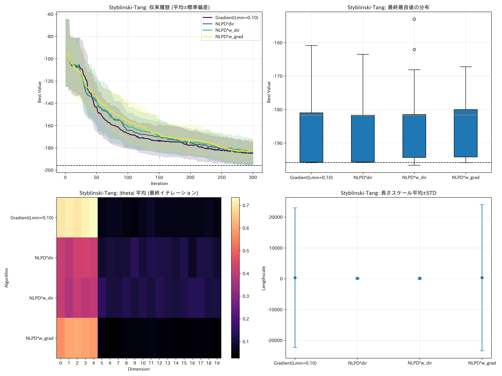
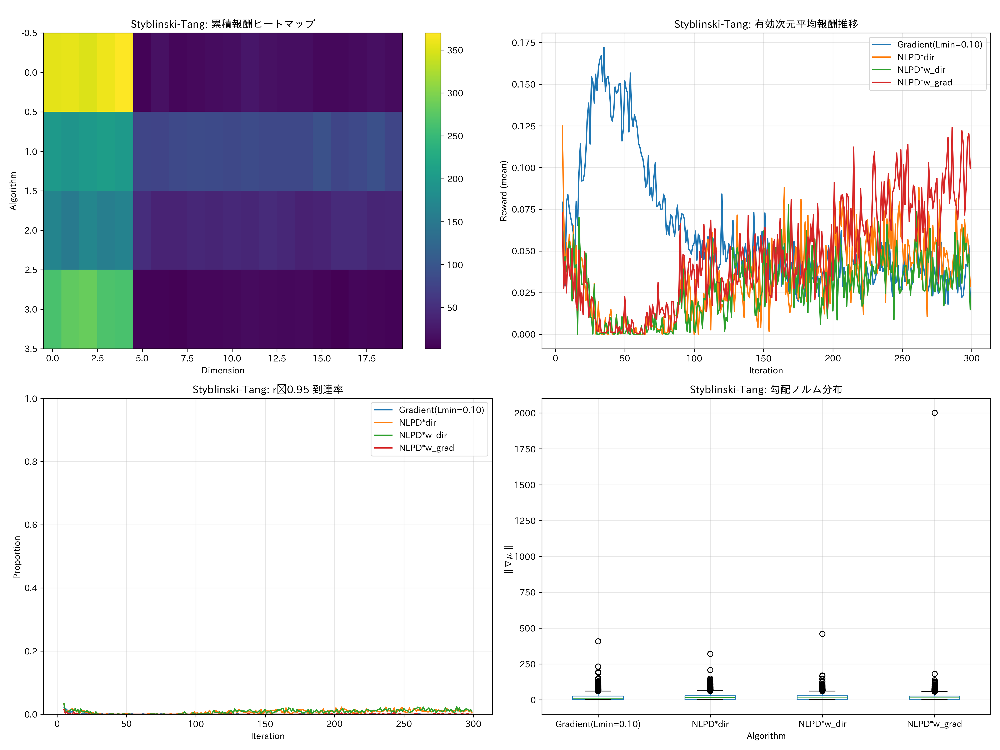
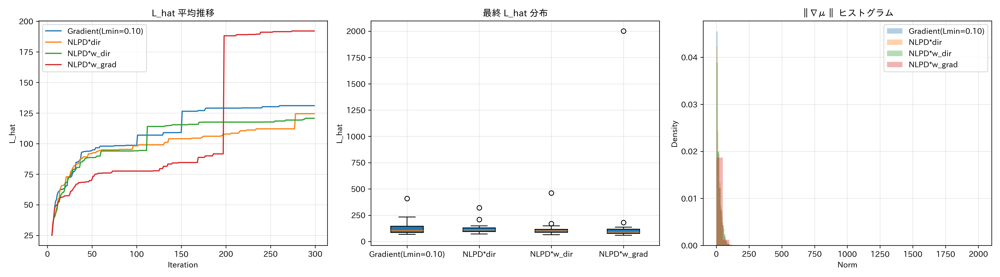
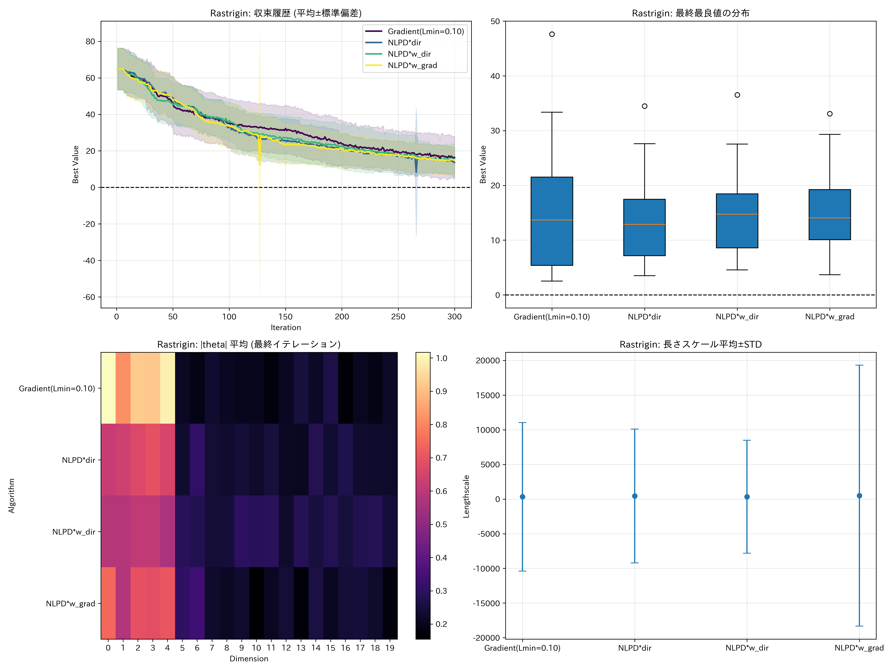
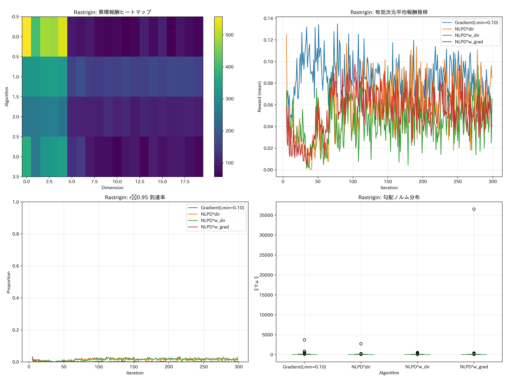
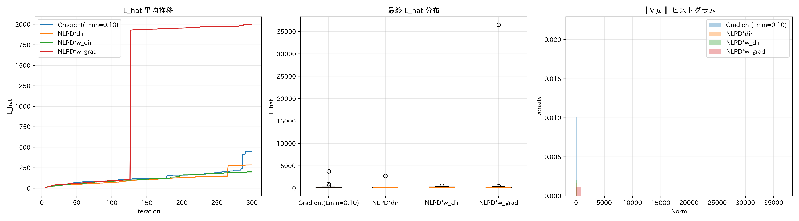
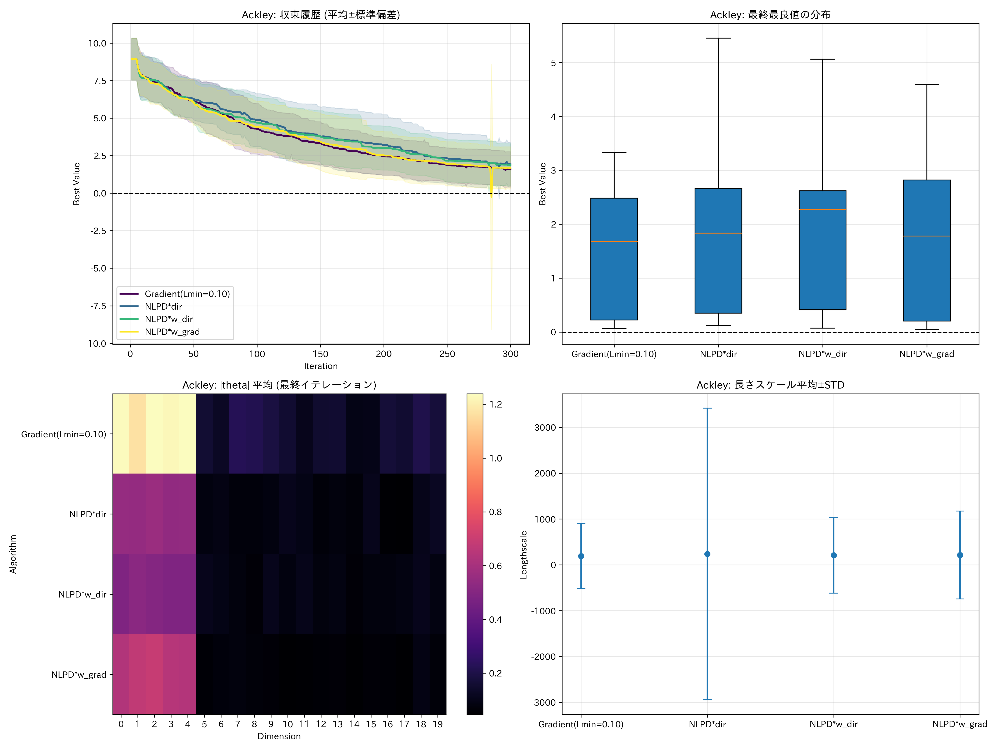
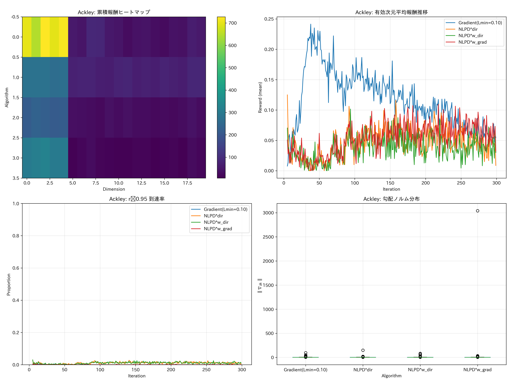
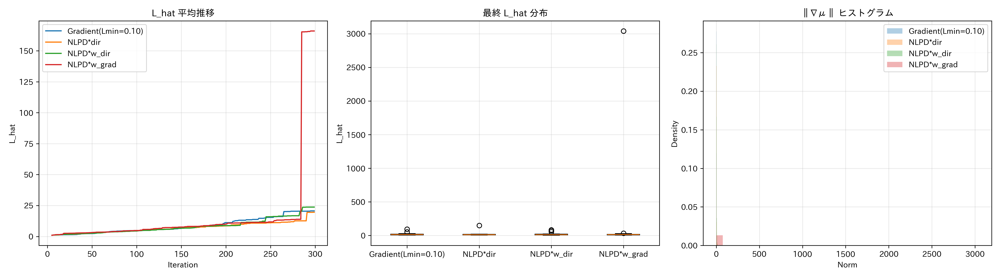

# 報酬関数比較実験（Gradient vs. NLPD）

本実験は、`lengthscale_lower_bound_sweep` の実験枠組み（入力正規化・モデル・可視化・出力形式）をそのまま用い、
「報酬関数」のみを切り替えて比較します。RBF(ARD) カーネルに長さスケール下限 `l_min=0.10` を固定し、
次の 4 方式を評価します。

- Gradient(Lmin=0.10): 既存の勾配ベース報酬
  - 定義: `r_vec = |∇μ(x_t)| / max(L_hat, L_min)`（各次元）。`L_hat` は履歴最大の ‖∇μ‖ を用い、`L_min=0.1` の下限でスパイクを抑制。
- NLPD*dir: サプライズ（負の対数予測密度, NLPD）をスカラー `r'` として計算し、方向ベクトル `a_t` に乗じて更新
  - 更新: `b ← b + r' · a_t`（LinUCB の `b` はベクトル）。
  - 解析用のログでは `|r' · a_t|` を各次元の報酬として記録（非負）。
- NLPD*w_dir: `r'` を `w_dir = |a_t| / ||a_t||_1` で次元配分して更新
  - 更新: `b ← b + r' · w_dir`（非負ベクトル、L1 和は `r'`）。
- NLPD*w_grad: `r'` を `w_grad = |∇μ(x_t)| / ||∇μ(x_t)||_1` で次元配分して更新
  - 更新: `b ← b + r' · w_grad`（非負ベクトル、L1 和は `r'`）。

ここで、NLPD は

\[ r_t^{\mathrm{NLPD}} = -\log p(y_t \mid x_t, \mathcal{D}_{t-1}) = \tfrac{1}{2} \log\!\big(2\pi\, \sigma_y^2(x_t)\big) + \frac{(y_t - \mu_{t-1}(x_t))^2}{2\,\sigma_y^2(x_t)} \]

とし、`σ_y^2(x) = s^2(x) + σ_n^2`（予測分散 + 観測ノイズ分散）。実装では `σ_y^2 ← max(σ_y^2, ε)` の数値安定化を入れ、
スカラー `r_t^{NLPD}` は指数移動平均（EMA）で正規化して `r' = clip(r / ema(r), 0, 1)` にスケーリングします。

## 共通設定（lengthscale_lower_bound_sweep と同一）
- 入力正規化: `X ∈ [0,1]^d` に正規化して GP 学習・予測。
- モデル: `SingleTaskGP(ScaleKernel(RBFKernel(ARD, lengthscale ≥ l_min)))`、`l_min=0.10` 固定。
- 獲得関数: `ExpectedImprovement(maximize=False)`。
- 方向選択: LinUCB（`A←I, b←0`、`θ=A^{-1}b`、`UCB = θ^T a + β_t √(a^T A^{-1} a)`）。
- 1次元化探索: 現最良 `x_best` と方向 `a` で線分 `x(t)=x_best + t a` を作り、EI を `t` 上で最適化して `x_new` を提案。
- 乱数: ラン `i` に対して `seed = 100·i` を `torch`/`numpy` に設定し、全アルゴリズムで同一初期点を共有。

## 実行方法
- 依存関係をインストール後、以下を実行:

```bash
# 既定: 3 関数 × 各 20 ラン × 300 評価
python3 exp/reward_function_comparison/run_reward_function_comparison.py

# ラン数や反復数を調整（lengthscale_lower_bound_sweep と互換の環境変数）
LS_SWEEP_RUNS=8 LS_SWEEP_ITERS=300 \
  python3 exp/reward_function_comparison/run_reward_function_comparison.py

# 関数を絞る（カンマ区切り）。互換キー or 本実験専用キーどちらでも可
LS_SWEEP_FUNCS=Rastrigin \
  python3 exp/reward_function_comparison/run_reward_function_comparison.py
RF_FUNCS=Styblinski-Tang,Ackley \
  python3 exp/reward_function_comparison/run_reward_function_comparison.py

# 比較アルゴリズムを絞る（カンマ区切り）
RF_REWARD_ALGS="Gradient(Lmin=0.10),NLPD*w_grad" \
  python3 exp/reward_function_comparison/run_reward_function_comparison.py
```

## 出力
- 保存先: `exp/reward_function_comparison/output_results_reward_function_comparison/`
- ファイル（関数名を `F` とする）:
  - `F_results.npy`: 反復ごとの最良事後平均履歴（各アルゴリズム × ラン）。
  - `F_comparison.png`: 収束曲線（平均±STD）/ 最終値箱ひげ / |θ| ヒートマップ / 平均 lengthscale。
  - `F_reward_analysis.png`: 累積報酬ヒートマップ / 有効次元平均報酬推移 / r≥0.95 到達率 / 勾配ノルム分布。
  - `F_diagnostics.png`: L_hat 推移 / 最終 L_hat 分布 / 勾配ノルム KDE。
  - `F_reward_history.csv`: `Algorithm,Run,Iteration,Dimension,Reward`（解析用に非負で記録）。
  - `F_dimension_summary.csv`: 次元別の報酬平均/STD/累積。
  - `F_lhat_history.csv`, `F_grad_norms.csv`, `F_r_upper_hit_rate.csv`: 時系列メトリクス。
  - `experiment_metadata.json`: 実験設定のスナップショット。

## 実験上の注意
- NLPD のスケーリング: 素の NLPD は桁が大きくなりやすい（外れ値で特に）。EMA 正規化 + クリップでスケールを揃え、
  `r'∈[0,1]` に収める設計とした（`reward_upper_threshold=0.95` も流用できる）。
- `NLPD*dir` の更新は符号付き（`a_t` の符号を保持）だが、解析用のログ（CSV/可視化）は非負ベクトル `|r' a_t|` を保存し、
  累積/到達率などの指標を他方式と共通スケールで比較できるようにしている。
- `w_grad` は `|∇μ|` の L1 正規化。`||∇μ||_1≈0` の場合は安全側の分母処理（ε）で安定化。
- すべての方式で `L_hat`（‖∇μ‖ の履歴最大）をログ化。勾配ベースではスケーリングに使用、NLPD 系では診断のみ。

## 期待される傾向（仮説）
- 滑らかな関数（Styblinski‑Tang）では、勾配ベースは `L_min` により安定化済みだが、NLPD*w_grad も有効次元を強調しやすく競合。
- 高周波（Rastrigin/Ackley）では、NLPD は「予測誤差 × 逆不確実性」を強めやすく、序盤の情報獲得を促す。EMA 正規化により過剰スパイクは抑制。
- `NLPD*dir` は方向の符号を活かすため θ の学習が速い局面がある一方、解析上の非負ログとの差に注意。

## 再現性
- `torch.manual_seed`, `np.random.seed` をランごとに固定し、各アルゴリズムで同一初期点・同一候補集合シードを共有。
- ハードウェア（CPU/GPU）に依らず再現可能。

---

問い合わせ先 / メモ:
- 本実験は「報酬」以外の全構成（探索・モデル・プロット・出力）を `lengthscale_lower_bound_sweep` と揃えています。
- 追加の報酬案（例：シャープネス、情報ゲイン近似、EI/PI/GP-UCB の混合）を評価する場合は、`run_reward_function_comparison.py`
  の `RewardFunctionLinBanditBO._compute_*` を拡張してください。

---

## 数式定義（厳密）

以降、反復を `t=1,2,...` とし、GP の（正規化入力で学習された）予測平均・分散をそれぞれ
`\mu_{t-1}(x),\; s^2_{t-1}(x)`、観測ノイズ分散を `\sigma_n^2` と表す。提案点を `x_t`、観測値を `y_t`。

- 入力の正規化: 実装では `x` を区間 `[0,1]^d` にアフィン変換して GP を学習・予測。勾配は連鎖律により
  元スケールへ変換して用いる（コードでは `∂\mu/∂x_norm` を `range` で割って `∂\mu/∂x` を得る）。

### 1) Gradient(Lmin=0.10)

勾配ベクトルを
\[
g_t \triangleq \nabla_x \mu_{t-1}(x_t)\in\mathbb{R}^d,\quad L_t \triangleq \lVert g_t \rVert_2,
\]
とする。履歴最大 `L_\text{hat}` を
\[
L_\text{hat}(t) \triangleq \max\{L_\text{hat}(t-1),\; L_t\},\quad L_\text{eff}(t) \triangleq \max\{L_\text{hat}(t),\; L_\min\},\; L_\min=0.1
\]
で更新し，報酬ベクトルは
\[
 r^{\text{grad}}_t \triangleq \operatorname{clip}_{[0,1]}\!\Big( \frac{|g_t|}{L_\text{eff}(t)} \Big) \in\mathbb{R}^d.
\]
線形バンディットの更新は
\[
 A_t \leftarrow A_{t-1}+a_t a_t^\top,\qquad b_t \leftarrow b_{t-1}+ r^{\text{grad}}_t.
\]

### 2) NLPD 系（共通のスカラー報酬）

予測の「サプライズ」スカラーを負の対数予測密度（NLPD）
\[
 r^{\text{NLPD}}_t \triangleq -\log p(y_t\mid x_t,\mathcal{D}_{t-1})
 = \tfrac{1}{2}\log\!\big(2\pi\,\sigma_y^2(x_t)\big) 
 + \frac{\big(y_t-\mu_{t-1}(x_t)\big)^2}{2\,\sigma_y^2(x_t)},
\]
\[
 \sigma_y^2(x_t) \triangleq s^2_{t-1}(x_t)+\sigma_n^2,\quad \sigma_y^2\leftarrow\max\{\sigma_y^2,\varepsilon\}.
\]
指数移動平均（EMA）でスケーリングし
\[
 m_t \leftarrow \alpha\, r^{\text{NLPD}}_t + (1-\alpha)\, m_{t-1},\quad (\alpha=0.1,\; m_0=\varepsilon),\qquad
 r'_t \triangleq \operatorname{clip}_{[0,1]}\!\Big( \tfrac{r^{\text{NLPD}}_t}{m_t} \Big).
\]

各方式の `b` 更新は次の通り（`a_t` は選択方向）。

- NLPD*dir:
  \[ b_t \leftarrow b_{t-1} + r'_t\, a_t. \]
  （解析用ログは `|r'_t a_t|` を各次元に記録）
- NLPD*w_dir:
  \[ w^{\text{dir}}_t \triangleq \tfrac{|a_t|}{\lVert a_t\rVert_1+\varepsilon},\; b_t \leftarrow b_{t-1} + r'_t\, w^{\text{dir}}_t. \]
- NLPD*w_grad:
  \[ w^{\text{grad}}_t \triangleq \tfrac{|g_t|}{\lVert g_t\rVert_1+\varepsilon},\; b_t \leftarrow b_{t-1} + r'_t\, w^{\text{grad}}_t. \]

---

## 実験結果サマリ（20次元・有効5次元・20ラン）

定量値は `*_results.npy` から算出（平均最終値、低いほど良い）。詳細は各図を参照。

### Styblinski‑Tang
- 最終値（300反復・平均）: Gradient -184.93、NLPD*dir -184.95、NLPD*w_dir -183.73、NLPD*w_grad -183.26。
- 早期〜中盤は Gradient が速く、終盤は NLPD*dir と実質同等に収束。
- 有効次元への累積報酬比率（上位5次元の占有率）: Gradient 89.5%、NLPD*dir 44.4%、w_dir 56.1%、w_grad 92.1%。

画像:







### Rastrigin
- 最終値（300反復・平均）: NLPD*dir 13.66（最良）、w_grad 15.05、w_dir 15.62、Gradient 16.35。
- 100反復以降で NLPD*dir が明確にリード。探索寄りの性質が高周波関数で有利。
- 有効次元への累積報酬比率: Gradient 68.4%、NLPD*dir 40.9%、w_dir 45.4%、w_grad 55.2%。

画像:







### Ackley
- 最終値（300反復・平均）: Gradient 1.58（最良）、w_grad 1.69、w_dir 1.89、NLPD*dir 1.92。
- 全期間で Gradient が安定してトップ。w_grad が僅差の次点。
- 有効次元への累積報酬比率: Gradient 82.2%、NLPD*dir 55.2%、w_dir 69.9%、w_grad 86.7%。

画像:







### 追加指標（抜粋）
- r≥0.95 到達率（平均）: Styblinski‑Tang で Gradient ≈0.0005、NLPD*dir ≈0.0073、w_dir ≈0.0078、w_grad ≈0.0004。Rastrigin と Ackley でも同様に NLPD 系がやや高いが全体としては低値（EMA正規化により飽和抑制）。
- 勾配ノルム/`L_hat` は外れ値で大振れするケースあり（特に Rastrigin と w_grad）。報酬はクリップ済みのため更新そのものは安定。

## 考察（まとめ）
- 単一の勝者は存在せず、目的関数の性質で最適な報酬が変わる。
  - 滑らか（Styblinski‑Tang）: Gradient が初期から安定に優位。終盤は NLPD*dir と同等。
  - 多峰・高周波（Rastrigin）: NLPD*dir が明確に優位。サプライズ×方向の設計が情報獲得を促進。
  - 中程度の凹凸（Ackley）: Gradient が一貫して最良。w_grad は僅差で追随。
- 次元配分の観点:
  - Gradient と w_grad は有効次元への集中が強く、exploitation 寄りの学習が進みやすい。
  - NLPD*dir は配分が広がり探索寄り（高周波関数での優位性と整合）。
- 実務的指針:
  - 滑らか/準凸寄りならまず Gradient(Lmin=0.10)。
  - 多峰・高周波なら NLPD*dir を第一候補（w_grad も検討価値）。
  - 迷う場合は「序盤 NLPD*dir で探索 → 後半 Gradient に切替」のハイブリッドが有望。

